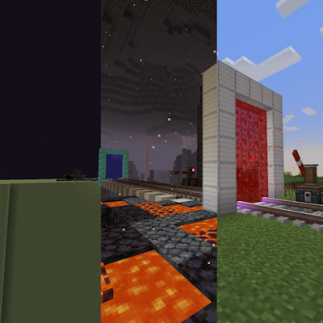

Portal Builder: Create Edition
=======

Where can I find and download the mod?
=======

You can find the mod on CurseForge https://www.curseforge.com/minecraft/mc-mods/portal-builder-create-edition

Dependencies:
=======
This mod depends on
- https://www.curseforge.com/minecraft/mc-mods/custom-portal-api-reforged
- https://www.curseforge.com/minecraft/mc-mods/create

Choosing the version that is right for you
=======
For Create versions below 6.0, use the 1.0.x release\
For Create versions equal or above 6.0.3, use the 1.1.x release

Credits:
=======
This mod was inspired from the following projects:
- https://github.com/kyrptonaught/DatapackPortals
- https://github.com/snorrethedev/Create-Trains-Custom-Portal-API-Compability

DEV Installation information
=======

Once you have your clone, simply open the repository in the IDE of your choice. The usual recommendation for an IDE is either IntelliJ IDEA or Eclipse.

JAVA 17 IS REQUIRED. Make sure your JAVA_HOME and your PATH in your environement variables
point to a java 17 jdk. You may have to restart your computer after changing it to JAVA 17.

Step 1: Open your command-line and browse to the folder where you cloned the project.
Then run `./gradlew genIntellijRuns` in the folder.

If at any point you are missing libraries in your IDE, or you've run into problems you can
run `gradlew --refresh-dependencies` to refresh the local cache. `gradlew clean` to reset everything
(this does not affect your code) and then start the process again.

Mapping Names:
=============================
By default, the MDK is configured to use the official mapping names from Mojang for methods and fields
in the Minecraft codebase. These names are covered by a specific license. All modders should be aware of this
license, if you do not agree with it you can change your mapping names to other crowdsourced names in your
build.gradle. For the latest license text, refer to the mapping file itself, or the reference copy here:
https://github.com/MinecraftForge/MCPConfig/blob/master/Mojang.md

Additional Resources:
=========================
Community Documentation: https://docs.minecraftforge.net/en/1.20.1/gettingstarted/ \
LexManos' Install Video: https://youtu.be/8VEdtQLuLO0 \
Forge Forums: https://forums.minecraftforge.net/ \
Forge Discord: https://discord.minecraftforge.net/

